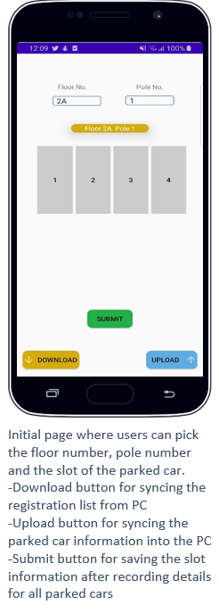
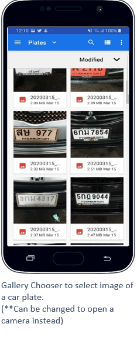
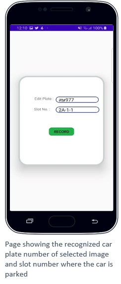
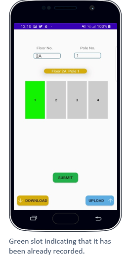

# CarPlateChecker

Car plate checker is an android application which allows its users to easily take picture of the parked cars which returns the recognized car plate number (using cloud vision API for OCR) and tells whether the car is registered to the system or not. With this application, the guards can easily record the slot information of the parked car which can be synced to the pc.

## User Interface

